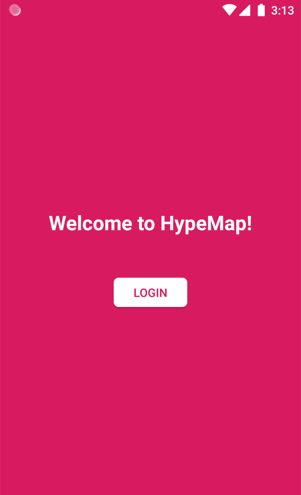
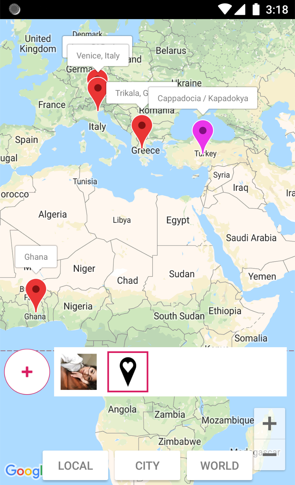
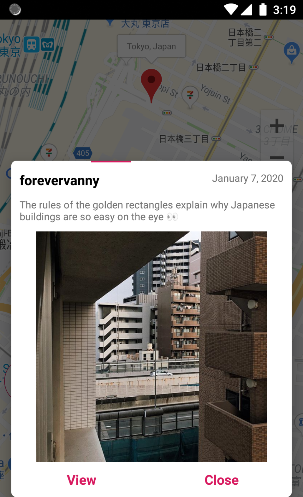

# HypeMap

Kotlin Android application that converts location-tagged Instagram posts into clickable markers on Google Maps. The markers are organized by user and newer posts are indicated with a different marker color. Clicking on the markers zooms into the location and a popup displays all the posts at that location. Any user being followed is kept up to date by performing background updates every few hours.

## Pre-requisites

- Android Studio 3.x

## Acknowledgments

To Beatrice Wong for drawing the logo and her amazing support.
